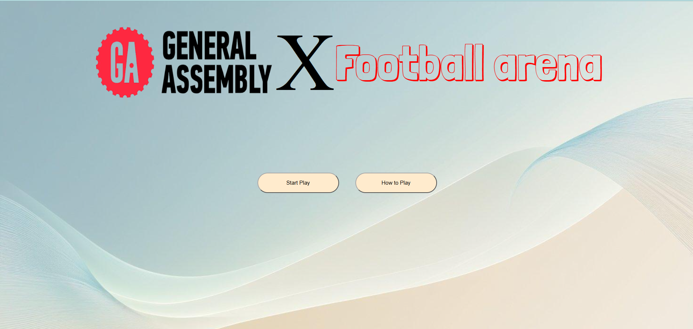
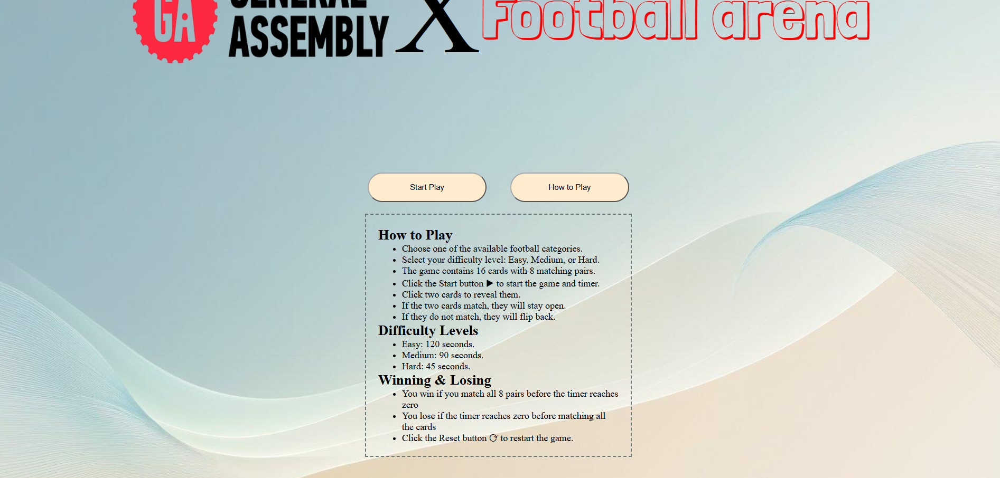
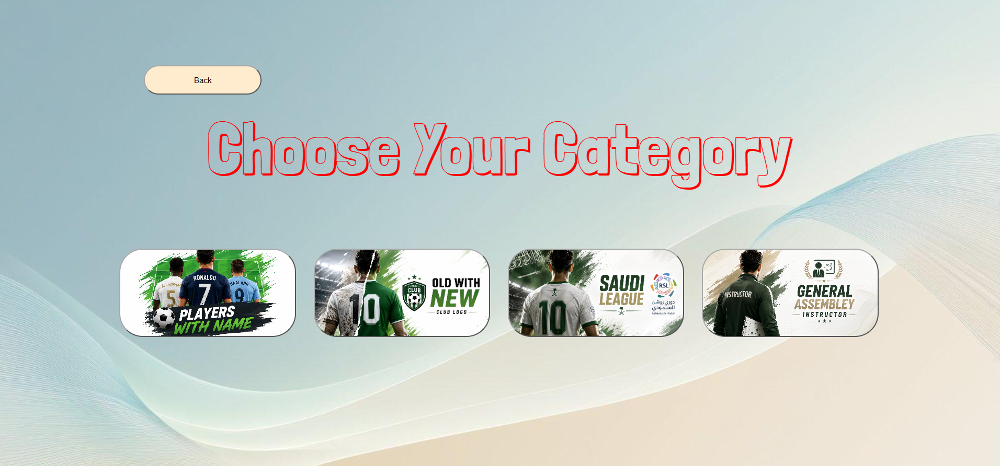
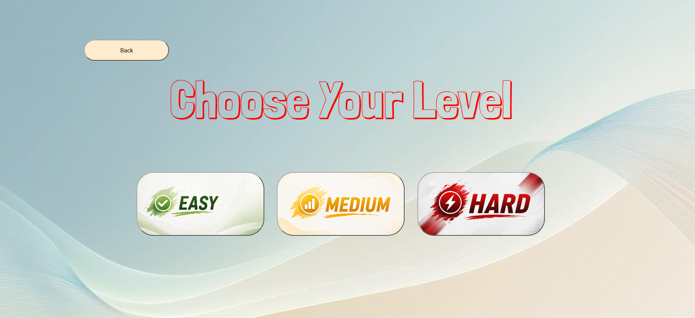
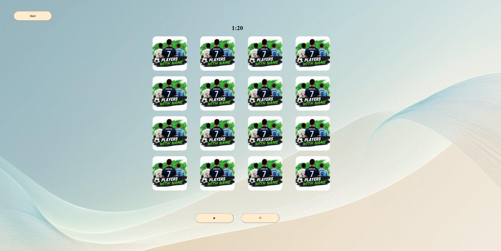

# Project Name

Football Arena

## Technologies Used

1. HTML
2. CSS
3. JavaScript

## Description

Football Arena is a memory card game where players choose a football category and difficulty level.

The player must match all card pairs before the timer reaches zero. Each difficulty level has a different time limit.

## User Stories

1. As a user, I want to see a start page so that I can begin the game.

2. As a user, I want to choose from different football categories so that I can play the challenge I prefer.

3. As a user, I want to choose a difficulty level so that I can select the challenge that suits me.

4. As a user, I want to play a memory card game with a countdown timer so that I can complete the challenge before time runs out.

5. As a user, I want to match two related cards so that I can progress through the game.

6. As a user, I want to see a win or lose message at the end of the game so that I know whether I successfully completed the challenge.

7. As a user, I want to reset the game so that I can play again.

8. As a user, I want to read the How to Play instructions so that I can understand the game rules.

## Screenshots

### Home Page

### How to Play

### Categories Selection

### Difficulty Selection

### Game Page

## Future Enhancements

- Add sound effects.
- Add a score system.
- Add more football categories.
- Add more difficulty levels.
- Add a leaderboard.
- Improve the game for mobile devices.

## Credits

- Developed by Mohamed Abdulla.
- Built as part of the General Assembly Software Engineering program.
- Project concept, design, and game logic developed for educational purposes.
- Football player and club images are used for educational purposes only.
- Special thanks to the General Assembly instructors for their guidance and support.